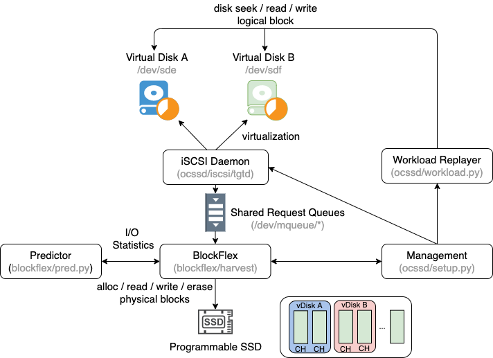

# BlockFlex: Enabling Storage Harvesting with Software-Defined Flash in Modern Cloud Platforms
BlockFlex is our learning-based storage harvesting framework, which can harvest flash-based storage resources at fine-grained granularity in modern clould platforms.

## 1. Overview
The following packages are necessary to install before running the following scripts. Please check our GitHub repo for the traces, code and scripts https://github.com/breidys2/BlockFlex.
```shell
#Easy command line download of google drive files
pip3 install gdown
#Performance analysis of predictors
pip3 install hwcounter
#Various useful python packages
pip3 install numpy matplotlib sklearn
#Install pytorch from this link: https://pytorch.org/get-started/locally/
```

## 2. Trace Analysis

### Figure 1
We use the Alibaba Cloud Traces[1] for Figure 1.

For plotting container utilization we sample 30,000 containers.  The results for the container plot are the same regardless if you use our parsed file or the original container_usage.csv from Alibaba. If you use container_usage.csv, you will need to modify the first line of the script accordingly. 

For plotting machine utilization, we use the full machine_usage.csv trace from Alibaba.
Finally, run the following (should take under 10 minutes):
```shell
cd Traces/

#(Optional) Grab the smaller container file (~1.3 GB)
gdown 1JMTT2CyMB_dyA86OfNwTPZUd2PhTX4ZW
gunzip container_usage_sub.csv.gz

#Creates the input file to the next command (ali_container_usage.dat)
python3 container_parser.py 
#Plot the container utilization (creates ali_container_usage.pdf)
python3 ali_container_usage.py

#Creates the input file to the next command (ali_machine_usage.dat)
python3 machine_parser.py 
#Plot the machine utilization (creates ali_machine_usage.pdf)
python3 ali_machine_usage.py
```
This will create Figures 1a and 1b in ali_container_usage.pdf and ali_machine_usage.pdf.

### Figure 2
We use Google's open source cluster traces[2] for Figure 2.

<details>
<summary>We will include the process to derive the results from scratch in this dropdown. It is faster to use the intermediate data files we provide below.</summary>
<br>

First, follow the instructions in [2] to download the full dataset.
```shell
#Copy the scripts into the google trace directory
cp prio_events_parser.py google-cloud-sdk/clusterdata-2011-2/
cp usage_parser.py google-cloud-sdk/clusterdata-2011-2/
#Run them (!! WARNING THIS WILL TAKE A LONG TIME)
#Produces the parsed_all_prio_events.csv file which contains the high priority VMs
python3 prio_events_parser.py

#Produces the usages_500.csv which is the total trace filtered by priority events
python3 usage_parser.py
#Copy the resulting files back into the Traces directory
cp parsed_all_prio_events.csv ../../
cp usages_500.csv ../../
```
</details>

Alternatively, use the provided parsed_all_prio_events.csv and download usages_500.csv:
```shell
#Download usages_500.csv (~60GB)
gdown 1maec7UF_6U8kMIHRGDpbPvTaqp6QrMxb
gunzip usages_500.csv.gz
```
Next, compute the cdf for utilization in the google trace:
(Takes under 25 minutes)
```shell
#Creates the input for the plotting (google_util_cdf.dat)
python3 google_util_parser.py 
#Plots the cdf for utilizations
python3 google_util_cdf.py
```
The final output is stored in google_util_cdf.pdf


### Figure 4
We use the Alibaba Cloud Traces[1] for Figure 4.

For plotting the availability of harvesting we sample 4,000 containers. We use the same container_usage.csv from Alibaba that is download from the previous step. Run the following (should take under 10 minutes):

```shell
# (Optional) Grab the smaller container file (~1.3 GB)
#Creates the input file to the next command (ali_stats_util_cdf.txt)
python3 ali_container_parse.py
#Convert from CDF data to Histogram (creates ali_harvesting_bar.dat)
python3 ali_container_cdf.py
#Plot the percentage of harvestable period
python3 ali_harvesting_bar.py
```
This will create Figures 4 in ali_harvesting_bar.pdf.

### Figure 15 and 16
We use the Alibaba Cloud Traces[1] for ploting the improved utilization for Figure 15 and Google's open source cluster traces[2] for Figure 16. The low priority VMs are generated from Google as well. 

```shell
# Grab the low priority container file (Utilizations/low_prio_vm_times_reparse.txt)
cd Utilizations
gdown 18Ea4IvdctyuT4kCA5uj_E6UVEUvvl7wg
# Parse the low prority VM file to generate harvest VM period and parse the foreground vm file to generate harvestable period. (creates low_prio_vm_hybrid.txt harvest_avail_times.txt)
python3 ali_parser_harvest.py
# Match low priority vms to foreground VMs (creates original_util.txt and improved_util.txt)
javac matcher.java && java matcher low_prio_vm_hybrid.txt harvest_avail_times.txt
# Convert from raw data to Plot data (creates alibaba_improved_util.dat)
python3 improved_util_cdf.py alibaba
#Plot the improved utilizations for Alibaba
python3 alibaba_improved_util.py

# Parse the low prority VM file to generate harvest VM period and parse the foreground vm file to generate harvestable period. (creates low_prio_vm_hybrid.txt harvest_avail_times.txt)
python3 google_parser_harvest.py
# Match low priority vms to foreground VMs (creates original_util.txt and improved_util.txt)
javac google_matcher.java && java google_matcher low_prio_vm_times_reparse.txt harvest_avail_times.txt
# Convert from raw data to Plot data (creates google_improved_util.dat)
python3 improved_util_cdf.py google
#Plot the improved utilizations for Google
python3 google_improved_util.py

#Exit the Traces directory
cd ../../
```

### Figure 3, Figure 5, Figure 6, and Figure 17
Ommitted due to business confidentiality

## 3. Predictor Analysis
The prediction directory contains some parsed traces of workloads, the predictors themselves as well as the scripts for plotting the accuracy measurements.

We begin by fetching the traces and preparing the inputs for the predictors. 
We include how each trace was produced in the following dropdowns and their associated scripts are in Predictions/TraceGen:  
<details>
<summary>Alibaba/Google</summary>
<br>
We randomly select 5 containers/VMs and isolate their workloads from the overall trace. They are preprocessed to be represented by {duration, amount} pairs where the VM is using amount resources for duration period of time. The predictors parse this into the same input format as described in the paper.
For reference, the scripts (train_gen_ali.py and train_gen_gl.py) to generate these pairs are included.
</details>
<details>
<summary>terasort</summary>
We install hadoop-3-3 using the hadoop documentation: https://hadoop.apache.org/docs/r3.3.0/hadoop-project-dist/hadoop-common/SingleCluster.html.The run_hadoop.sh script provides a reference to how we collect the traces. We generate a 75GB dataset with TeraGen and then sort it with TeraSort. Traces are collected using blktrace. The size information is collected with check.sh which uses the 'du' command to track the size of the hadoop directory.

<br>
</details>

<details>
<summary>graphchi</summary>
<br>
We install graphchi using their git repo: https://github.com/GraphChi/graphchi-cpp. The run_graphchi.sh script provides a reference to how we collect the traces. We use graphchi's sample implementation of pagerank and input the Friendster graph. As with hadoop, the size information is collected with check.sh
</details>


<details>
<summary>ml_prep</summary>
We download the 2017 ImageNet dataset and repeatedly run simple preprocessing operations to mimic a batch processing of images for ML training. The python file and run_ml_prep.sh are included for reference.
<br>
</details>

The preparation scripts mimic the statistic collections of BlockFlex by reporting aggregations across the reporting window. This gives the same set of inputs the predictor would receive if it were receiving inputs from BlockFlex, but in an offline manner.

```shell
#Enter the prep directory
cd Prep/

#Download the traces (~21 GB)
gdown 1hWZJOKNyumce0UNo45zb3_pfyytwg2YC
#Unzip them, should have a number of file with the format WORKLOAD_NUM.sizing and WORKLOAD_num.trace
tar -xzvf traces.tar.gz

#Prepare directories for outputs of next scripts:
mkdir inputs
mkdir inputs/bw
mkdir inputs/sz
mkdir inputs/dur_bw
mkdir inputs/dur_sz

#Run the preparation scripts
#Should create a set of files with the format WORKLOAD_NUM_stats in the input/bw directory
./regen_bw.sh
#Should create a set of files with the format WORKLOAD_NUM_sizing in the input/sz directory
# and a set of files with the format WORKLOAD_NUM_dur in the input/dur_sz directory
./regen_size.sh
#Should create a set of files with the format WORKLOAD_NUM_dur in the input/dur_bw directory
./regen_duration.sh

#We are done in this directory
cd ../
```

Now that we have the inputs prepared, we go into the predictor directory and run them on the inputs
```shell
#Enter the Predict directory
cd Predict/
```

 Each of these scripts can be run stand-alone. They copy the prepared files from the Prep directory into the local inputs. Then, runs the predictor on each 5 times. Then parses and reports the accuracy numbers. The inputs for alibaba and google traces are already in the local input directories and are not copied first.

```shell
#First prepare the output directories
mkdir outputs
mkdir outputs/bw
mkdir outputs/sz
mkdir outputs/dur_bw
mkdir outputs/dur_sz

#Run the bandwidth predictor
./run_all_bw.sh

#Run the size predictor
./run_all_sizing.sh

#Run the bandwidth duration predictor
./run_all_dur_bw.sh

#Run the size duration predictor
./run_all_dur_sizing.sh
```

## 4. BlockFlex
We provide an internet-accessible machine to our programmable SSD platform. Currently, it is only available for artifact evaluation purposes. Please contact us for accessing the machine. 

You will find two directories under BlockFlex: ocssd/ and blockflex/. Directory ocssd/ contains the iSCSI virtual disk environment, the management scripts and the workload replayer. Directory blockflex/ contains the main repo for the BlockFlex framework. The BlockFlex repository is (partially) structured as following:

```shell
├── blockflex
│   ├── blklist.c
│   ├── blklist.h
│   ├── channel.c
│   ├── channel.h
│   ├── harvesting_bflex.c   #  the storage harvesting program of BlockFlex
│   ├── lstm_bw.py     # bandwidth predictor
│   ├── lstm_dur.py    # duration predictor
│   ├── lstm_sz.py     # capacity predictor
│   ├── Makefile
│   ├── pred.py   # the bandwidth and capacity predictor 
│   ├── vssd.c   # the vssd structure
│   ├── vssd.h
├── Makefile
└── ocssd
    ├── imgs   # dummy file backend images
    ├── iscsi  # iscsi disk virtualization daemon
    │   ├── bs_rdwr.c   # the virtual disk request handler
    ├── logs   # iscsi and predictor logs
    ├── macros.py
    ├── Makefile
    ├── mqueue_cleaner
    ├── mqueue_cleaner.c
    ├── ocssd_queue.h  # the header file for the request queues
    ├── plot_bw.py  # plot harvesting bandwidth
    ├── prepare.sh  # env setup
    ├── results   # bandwidth harvesting plots
    ├── setup.py  # the management program
    ├── traces  # trace files
    └── workload.py  # the workload replayer
```

The workflow of BlockFlex is shown in the figure below. Once the management program **setup.py** is launched, it will first setup the virtual disks **/dev/sde** and **/dev/sdf**. One of them will run the storage harvesting VM program, and another will run the regular VM program. You should be able to see them with the fdisk command. Then it will run blockflex storage harvesting **blockflex/harvest** to create the vssds and the shared request queue between the blockflex and virtual disks. An iSCSI daemon **tgtd** will forward the block I/O request from the virtual disks to the blockflex. Blockflex will allocate physical flash channels and perform actual read / write operations. Finally, the management will launch the workload replayer **workload.py** and the predictors **pred.py**. The workload replayer takes input traces, and performs I/O to the virtual disks. The predictor receives I/O statictics from BlockFlex and performs bandwidth / capacity prediction. You should see all the running processes with the ps command.

<p align="center">
    
</p>

To obtain the bandwidth improvement plots in Figure 18 and 19, please follow these instructions. 

 ```shell
cd ~/BlockFlex/
# Make iSCSI, BlockFlex Programs, and Message queue listener.
make clean
make
cd ocssd/
# Setup directories, kernel modules, and message queues
./prepare.sh
# Run the management script to setup iSCSI virtual disks, the BlockFlex program, the predictor, and the workload replayer. 
# The choice of workloads are ML Prep, PageRank, and TeraSort. Each workload runs in three modes: harvest (sold), harvest (unsold), no harvest (static). 
# Each mode takes around 30 ~ 40 minutes to complete. You may want to launch a tmux session to run it in the background. 
# If you run into any issue, try "sudo python3 setup clean".
sudo python3 setup.py
# Plot the bandwidth harvesting results in ocssd/results/[workload]
sudo python3 plot_bw.py [ml_prep|pagerank|terasort]
 ```

## 5. Sources

[1]. https://github.com/alibaba/clusterdata/blob/master/cluster-trace-v2018/trace_2018.md  
[2]. https://github.com/google/cluster-data/blob/master/ClusterData2011_2.md
